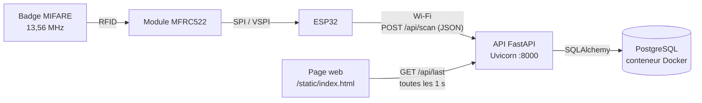
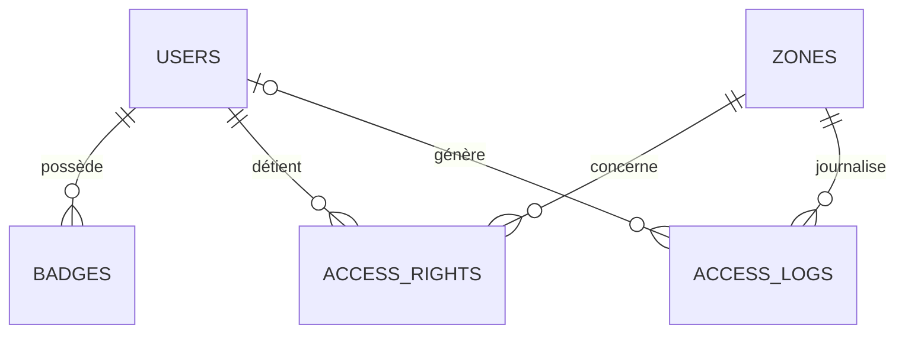

# Pointeuse 2.0 — Contrôle d'accès et pointage par badge RFID


> **Mini-projet de cours — BTS CIEL (option IR), 1ʳᵉ année.**
> Mission « Pointeuse 2.0 » pour la COGIP (cas d'étude) : remplacer une pointeuse électromécanique par un prototype connecté basé sur la lecture de badges RFID.

---

## Sommaire

1. [Contexte](#contexte)
2. [Fonctionnalités](#fonctionnalités)
3. [Architecture](#architecture)
4. [Matériel et câblage](#matériel-et-câblage)
5. [Stack logicielle](#stack-logicielle)
6. [Modèle de données](#modèle-de-données)
7. [API](#api)
8. [Installation et lancement](#installation-et-lancement)
9. [Recette et conformité aux exigences](#recette-et-conformité-aux-exigences)
10. [Limites et analyse de sécurité](#limites-et-analyse-de-sécurité)
11. [Documentation](#documentation)

---

## Contexte

Les pointeuses électromécaniques anciennes présentent trois limites majeures :

- **Maintenance** : usure mécanique, pièces introuvables, aucun autodiagnostic ni dépannage à distance.
- **Exploitation des données** : stockage papier, pas de synchronisation NTP, pas d'interface réseau (Ethernet/Wi-Fi, API REST) pour alimenter le système d'information.
- **Évolutivité** : matériel figé, pas de mise à jour à distance (OTA), pas de gestion dynamique des droits ni d'authentification moderne (RFID/NFC).

Ce projet propose un **prototype fonctionnel de bout en bout** : un badge RFID est lu par un microcontrôleur, la lecture est envoyée à une API qui décide de l'accès, journalise l'événement en base de données et affiche le résultat en temps réel sur une page web.

## Fonctionnalités

- Lecture sans contact de badges **MIFARE Classic 1K** (13,56 MHz, ISO/IEC 14443-A) via un module **MFRC522** sur bus SPI.
- Transmission du NUID de l'ESP32 vers l'API par **Wi-Fi** (requête HTTP `POST` en JSON).
- **Identification du salarié** et **contrôle des droits d'accès par zone**, avec une politique de **refus par défaut** (*default deny*).
- **Journalisation** de chaque tentative de badgeage (autorisée ou refusée) dans PostgreSQL.
- **Supervision en temps réel** : page web affichant le dernier badgeage (vert = accordé, rouge = refusé).
- **Administration** (utilisateurs, zones, badges, droits) via la documentation interactive Swagger UI.
- Signalisation locale par la LED intégrée de l'ESP32 (GPIO 2) à chaque badge décodé.

## Architecture



**Déroulé d'un badgeage :**

1. L'ESP32 détecte un badge et lit son NUID (4 octets) via le RC522.
2. Il envoie `{"nuid":"…","zone":"Salle serveur"}` à `POST /api/scan`.
3. L'API retrouve le badge et le salarié associé, vérifie que le badge est actif puis qu'un droit existe pour la zone demandée.
4. Le résultat est enregistré dans `access_logs` et renvoyé à l'ESP32 (`{"nuid":…,"utilisateur":…,"autorise":…}`).
5. La page web de supervision affiche le résultat.

## Matériel et câblage

**Matériel :** carte ESP32, module RFID **RC522**, badges MIFARE Classic 1K, câbles de liaison.

Le câblage est réalisé **hors tension**, puis contrôlé avant de brancher l'USB.

| Broche RC522 | Broche ESP32 | Signal / remarque |
| :--- | :--- | :--- |
| **NSS** (SDA) | GPIO 5 | VSPI-SS |
| **SCK** | GPIO 18 | VSPI-SCK |
| **MOSI** | GPIO 23 | VSPI-MOSI |
| **MISO** | GPIO 19 | VSPI-MISO |
| **IRQ** | *non connecté* | lecture par scrutation (*polling*) |
| **RST** | GPIO 4 | reset matériel |
| **GND** | GND | masse commune |
| **3.3V** | 3V3 | alimentation 3,3 V |

> Le RC522 s'alimente en **3,3 V** : ne pas le raccorder au 5 V.

## Stack logicielle

| Couche | Technologie |
| :--- | :--- |
| Firmware | Arduino (C++) sur ESP32 — `WiFi.h`, `HTTPClient.h`, bibliothèque MFRC522 |
| API REST | FastAPI + Uvicorn (`uvicorn[standard]`) |
| ORM | SQLAlchemy ≥ 2.0 |
| Validation | Pydantic ≥ 2 |
| Driver BDD | `psycopg2-binary` |
| Base de données | PostgreSQL dans un conteneur Docker (volume persistant `cogip-data`) |
| Supervision | Page HTML/JavaScript (`fetch()` + `setInterval()`) |
| Analyse réseau | Wireshark |

## Modèle de données

Cinq tables :

| Table | Champs principaux |
| :--- | :--- |
| `users` | `id` (PK), `nom`, `prenom`, `email`, `actif` |
| `badges` | `id` (PK), `nuid` (unique, indexé), `user_id` (FK), `actif` |
| `zones` | `id` (PK), `nom` (unique), `description` |
| `access_rights` | `id` (PK), `user_id` (FK), `zone_id` (FK), contrainte `UNIQUE(user_id, zone_id)` |
| `access_logs` | `id` (PK), `nuid`, `user_id` (FK, nullable), `zone_id` (FK), `timestamp`, `granted` |

**Choix de conception :**

- Le **NUID n'est pas la clé primaire** : il n'est pas garanti unique (*Non-Unique IDentifier*), peut être usurpé (cartes à UID modifiable) et un changement de technologie de badge (ex. DESFire, UID de 7 octets) obligerait à modifier toutes les clés étrangères. Il reste une clé métier **unique et indexée** (recherche en O(log N) à chaque badgeage).
- La contrainte `UNIQUE(user_id, zone_id)` interdit les droits en doublon.
- `user_id` est nullable dans `access_logs` pour journaliser aussi les badges inconnus.



## API

| Méthode | Route | Rôle |
| :--- | :--- | :--- |
| `POST` | `/api/users` | Créer un salarié |
| `POST` | `/api/zones` | Créer une zone |
| `POST` | `/api/badges` | Associer un badge (NUID) à un salarié |
| `POST` | `/api/access-rights` | Accorder l'accès d'un salarié à une zone |
| `POST` | `/api/scan` | Route appelée par l'ESP32 à chaque badgeage |
| `GET` | `/api/last` | Dernier badgeage (utilisé par la page de supervision) |
| `GET` | `/docs` | Documentation interactive Swagger UI |
| `GET` | `/static/index.html` | Page de supervision |

Les autres opérations d'administration (consultation, modification) sont disponibles dans Swagger UI (`/docs`).

## Installation et lancement

### Prérequis

- Docker et Docker Compose
- Python 3.10+
- Arduino IDE (ou PlatformIO) avec le support ESP32 et la bibliothèque **MFRC522**
- Le serveur et l'ESP32 sur le **même réseau local**

### 1. Cloner le dépôt

```bash
git clone <URL_DU_DEPOT>
cd <NOM_DU_DEPOT>
```

### 2. Configurer les secrets

Le mot de passe de la base n'est **jamais écrit en dur** dans `docker-compose.yml` : il est lu depuis un fichier `.env`, exclu du dépôt via `.gitignore`.

```bash
echo "DB_PASSWORD=choisir_un_mot_de_passe" > .env
```

### 3. Démarrer PostgreSQL

```bash
docker compose up -d
```

La base est stockée dans le volume Docker `cogip-data` : les données survivent à la suppression du conteneur.

Vérification du contenu :

```bash
docker exec -it cogip-db psql -U cogip -d pointeuse
```

### 4. Lancer l'API

```bash
python -m venv .venv
source .venv/bin/activate        # Windows : .venv\Scripts\activate
pip install -r requirements.txt
uvicorn main:app --host 0.0.0.0 --port 8000
```

`--host 0.0.0.0` est nécessaire pour que l'ESP32 puisse joindre l'API depuis le réseau local (voir [Limites](#limites-et-analyse-de-sécurité)).

### 5. Déclarer des données de test

Ouvrir `http://localhost:8000/docs`, puis créer dans l'ordre : un utilisateur, une zone, un badge, un droit d'accès. Exemple de corps pour `POST /api/badges` :

```json
{ "nuid": "AABBCCDD", "user_id": 1, "actif": true }
```

> Sans droit enregistré pour une zone, l'accès est **refusé** (*default deny*).

### 6. Flasher l'ESP32

Dans le firmware, renseigner :

- le **SSID** et la **clé WPA/WPA2** du réseau Wi-Fi ;
- `API_URL` : l'adresse IP du serveur (`hostname -I` sous Linux, `ipconfig` sous Windows), par exemple `http://<IP_SERVEUR>:8000/api/scan` ;
- la zone ciblée (`Salle serveur`).

Téléverser le programme, ouvrir le moniteur série à **115 200 bauds**, puis présenter un badge.

> **IP fixe obligatoire.** L'URL de l'API est inscrite en dur dans le firmware : prévoir une adresse IP statique ou une réservation DHCP pour le serveur, sinon la pointeuse perd la communication dès que l'adresse change.

### 7. Superviser

Ouvrir `http://<IP_SERVEUR>:8000/static/index.html` : le résultat de chaque badgeage s'affiche en temps réel.

## Recette et conformité aux exigences

**Scénarios de recette** (chaîne complète lecteur → ESP32 → API → PostgreSQL → page web) : 5 cas testés, **tous validés** — badge autorisé, badge inconnu (refusé), badge désactivé (refusé), etc. Le détail est dans le compte rendu (question 27).

**Matrice de traçabilité SysML** : sur 9 exigences, **7 sont conformes** et **2 partiellement conformes** :

| Exigence | Statut | Raison |
| :--- | :---: | :--- |
| 1.1.1 — Lecture en moins de 300 ms | Partiel | Lecture SPI < 50 ms, mais le cycle complet (HTTP + SQL) n'a pas été mesuré sur banc (analyseur logique / oscilloscope) et peut varier avec la gigue Wi-Fi. |
| 1.5.1 — Édition des droits par le RH | Partiel | Faisable via l'API (Swagger UI), mais aucune interface RH conviviale n'a été développée. |

## Limites et analyse de sécurité

Ce projet est un **prototype pédagogique**, pas un système prêt pour la production. L'analyse du compte rendu en identifie les faiblesses :

| Faiblesse | Constat | Piste d'amélioration |
| :--- | :--- | :--- |
| **HTTP en clair** | Capture Wireshark : NUID et identités circulent en texte brut sur le LAN (écoute, rejeu possibles). | HTTPS/TLS via reverse proxy, jetons signés (HMAC/JWT), *nonce* et horodatage. |
| **NUID = identifiant public** | Transmis en clair par radio, copiable avec un smartphone NFC sur une carte à UID modifiable (« Magic Card »). | Badges chiffrés MIFARE DESFire EV2/EV3, authentification par défi-réponse. |
| **Attaque par relais** | Contourne même la cryptographie forte. | *Distance bounding*, double facteur (badge + PIN), étuis anti-RFID. |
| **API exposée** (`0.0.0.0`, `/docs` ouvert) | Accessible à tout le réseau local. | Pare-feu (n'autoriser que l'ESP32), VLAN IoT, clé d'API, HTTPS. |
| **Dépendance totale au serveur** | Serveur en panne = porte fermée, pointages perdus, lecteur gelé jusqu'au *timeout* (SPOF). | Liste blanche en mémoire flash (LittleFS/NVS), journal local avec envoi différé (*store & forward*), horloge RTC (DS3231), redondance serveur. |
| **Supervision par *polling*** | Requête toutes les secondes, même sans événement. | WebSocket (mode *push*, latence < 10 ms). |
| **Lecture par scrutation** | Consomme du CPU et de l'énergie. | Utiliser la broche IRQ du RC522 (interruption `FALLING`) et le mode veille de l'ESP32. |

**Conclusion d'usage :** ce système convient à la **gestion des temps de présence** et à l'accès à des **zones à faible enjeu** (parking, cafétéria, locaux généraux). Il est **inadapté** à la protection de zones critiques (salle des coffres, salle serveur, archives confidentielles).

## Documentation

Le compte rendu complet du projet, qui répond aux 35 questions de la mission (analyse de l'existant, UML/SysML, SPI et RC522, Docker, modèle de données, API, recette, Wireshark, sécurité), se trouve dans [`compte_rendu.md`](compte_rendu.md).

Les diagrammes (cas d'utilisation, classes, exigences SysML) figurent dans le rapport Word du projet.

## Auteur

**Malo** — BTS CIEL (option IR), 1ʳᵉ année.
